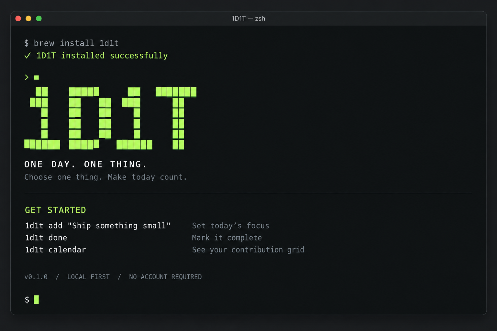

<p align="center">
  
</p>

<h1 align="center">1D1T</h1>
<p align="center"><strong>ONE DAY. ONE THING.</strong><br>
Take a day. Feel the love in everything.</p>
<p align="center">今天，只做一件重要的事。</p>
<p align="center"><a href="#开始使用">开始使用</a> · <a href="docs/usage.md">命令指南</a> · <a href="docs/homebrew.md">Homebrew 安装</a></p>

---

在 Terminal 里选定今天的一个重点。完成时留下一句记录，让日子在贡献日历中慢慢亮起来。

**离线使用 · 数据留在本机 · 每天一个重点 · 没有完成率或评分**

## 打开终端，从一件事开始



欢迎界面设计预览。图中的 `brew install 1d1t` 是示意文案，当前安装方式见下方指南。
实际欢迎界面运行 `1d1t welcome` 查看。

## 一天的使用方式

```sh
# 选定今天最重要的一件事
1d1t add "把一直想写的文章写完"

# 随时看一眼今日重点
1d1t today

# 完成后，为今天留一句话
1d1t done "终于把想说的话写下来了"

# 看见那些留下记录的日子
1d1t calendar
```

每天只有一个重点。尚未完成时可以修改；完成后，当天不再追加另一件事。
昨天没做完的事留在昨天，你可以用 `1d1t carry` 主动沿用。

## 让日子留下痕迹

贡献日历采用 GitHub 风格的方格：一天最多点亮一格，只表示那天有完成记录。
默认查看最近 12 周，也可以回看整年。

| 想做什么 | 命令 |
| --- | --- |
| 查看贡献日历 | `1d1t calendar` |
| 回看某一年 | `1d1t calendar --year 2026` |
| 查看本周或本月记录 | `1d1t stats --week` / `1d1t stats --month` |
| 翻看历史事项 | `1d1t history` |
| 修改今日重点 | `1d1t edit "新的重点"` |
| 撤销今日完成 | `1d1t undo` |
| 补记昨天已有的重点 | `1d1t done --date 昨天` |

更多规则见 [完整使用指南](docs/usage.md)。

## 开始使用

目前面向 macOS Terminal，需要 Python 3.9 或更新版本，无第三方 Python 运行依赖。

```sh
git clone https://github.com/vinono/1D1T.git
cd 1D1T
python3 scripts/install.py
```

安装器会显示欢迎界面，并在 `~/.local/bin/1d1t` 创建命令链接。
若命令未找到，将以下内容加入 shell 配置：

```sh
export PATH="$HOME/.local/bin:$PATH"
```

使用此方式安装后请保留项目目录。也可以直接运行 `./bin/1d1t welcome` 体验。

**偏好 Homebrew？** 已提供并验证本地 Tap 打包与安装流程，见 [Homebrew 安装指南](docs/homebrew.md)。
公开 Tap 尚未发布，暂不能直接使用 `brew install 1d1t`。

## 属于你自己的记录

无需账号或联网。记录保存在：

```text
~/Library/Application Support/1D1T/focus.sqlite3
```

从任何目录调用命令都会读取同一份数据。退出所有命令后，复制数据目录即可备份。
卸载命令不会删除记录。详见 [数据格式](docs/storage.md)。

## 项目方向

第一版专注终端体验。后续计划是原生 macOS App，共用本地记录；App 尚未实现。

```sh
# 在临时数据库中运行测试
python3 -m unittest discover -s tests -v
```

---

*Take a day. Feel the love in everything.*

## 命名与落地页

`1D1T` 是品牌名，`1d1t` 是终端命令；`oneDayOneThing/` 是内部 Python 包，
使用字母开头以支持标准 Python 导入。它们指向同一个项目。

独立落地页源码在 `site/`，使用 GitHub Pages 托管；配置方式见 [Pages 部署指南](docs/pages.md)。
