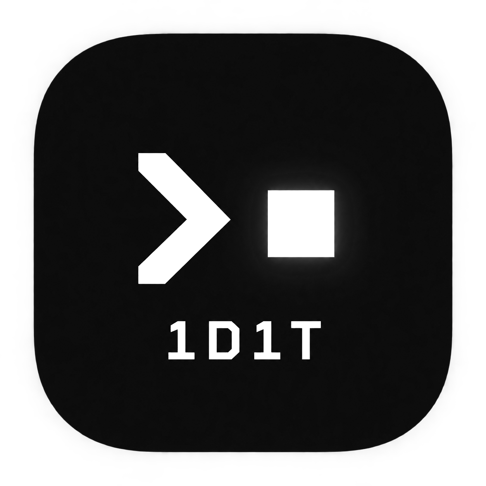
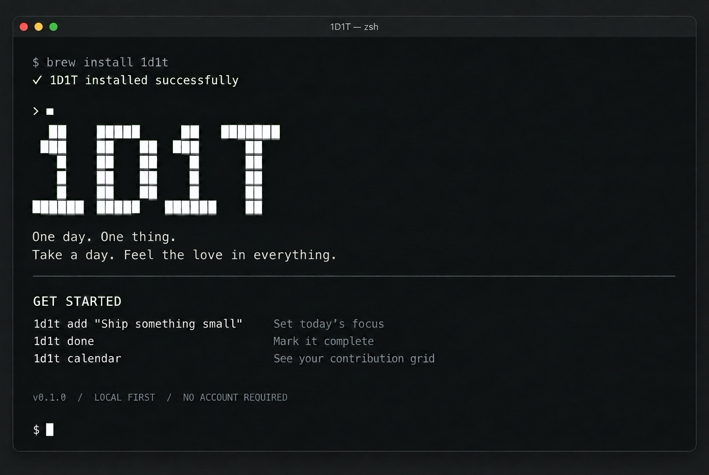

<p align="center">
  
</p>

<h1 align="center">1D1T</h1>
<p align="center"><strong>One day. One thing.</strong><br>
Take a day. Feel the love in everything.</p>

---

1D1T 是一个在 macOS 终端里使用的每日重点记录工具。
选定今天最重要的一件事，完成后留下一句话，让贡献日历慢慢亮起来。

**每天一个重点 · 离线使用 · 数据保存在本机 · 无需账号**

## 从一件事开始

```sh
1d1t add "把一直想写的文章写完"
1d1t today
1d1t done "终于把想说的话写下来了"
1d1t calendar
```

每天只选一个重点，未完成时可以修改，完成后当天不再追加另一件事。
昨天没做完的事会留在昨天；如果今天想继续，可以主动沿用。

贡献日历中，一天最多点亮一格，表示这一天有完成记录。没有完成率，也没有评分。



## 开始使用

在 macOS 上使用 [Homebrew](https://brew.sh/) 安装：

```sh
brew tap vinono/tap
brew install 1d1t
```

如果 Homebrew 提示 `untrusted tap`，先信任此 Formula，再重试安装：

```sh
brew trust --formula vinono/tap/one-day-one-thing
brew install 1d1t
```

然后，选定今天的一件事：

```sh
1d1t add "把一直想写的文章写完"
```

Homebrew 会自动安装所需的 Python。也可以使用完整名称一行安装：

```sh
brew install vinono/tap/1d1t
```

[安装与升级指南](docs/homebrew.md) · [v0.1.0 发布说明](https://github.com/vinono/1D1T/releases/tag/v0.1.0) · [项目主页](https://vinono.github.io/1D1T/)

## 日常使用

直接运行 `1d1t` 即可查看今日状态。其他常用操作如下：

| 想做什么 | 命令 |
| --- | --- |
| 选定今日重点 | `1d1t add "今天重要的一件事"` |
| 查看今日重点 | `1d1t today` |
| 修改今日重点 | `1d1t edit "调整后的重点"` |
| 记录完成，可附一句说明 | `1d1t done "为今天留一句话"` |
| 撤销今日完成 | `1d1t undo` |
| 沿用昨天未完成的重点 | `1d1t carry` |
| 补记昨天已有的重点 | `1d1t done --date 昨天` |
| 查看最近 12 周贡献日历 | `1d1t calendar` |
| 回看某一年的贡献日历 | `1d1t calendar --year 2026` |
| 查看本周或本月记录 | `1d1t stats --week` / `1d1t stats --month` |
| 翻看历史事项 | `1d1t history` |

沿用不会改变昨天的记录；补记归属重点原本的日期。
日期按系统本地时间计算。更多规则与参数见 [完整使用指南](docs/usage.md)。

## 记录属于你

所有记录保存在本机的 SQLite 文件中：

```text
~/Library/Application Support/1D1T/focus.sqlite3
```

从任何目录运行命令，都会读取同一份数据。退出所有 1D1T 命令后，复制整个数据目录即可备份。
移除命令链接不会删除记录。

需要独立的数据目录时，可使用 `--data-dir` 或 `ONE_DAY_ONE_THING_DATA_DIR` 环境变量，详见 [使用指南](docs/usage.md#数据)。

---

<p align="center"><em>One day. One thing.<br>
Take a day. Feel the love in everything.</em></p>
